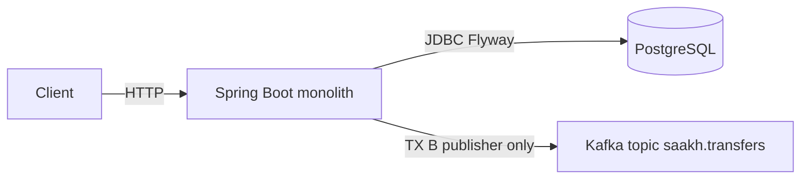
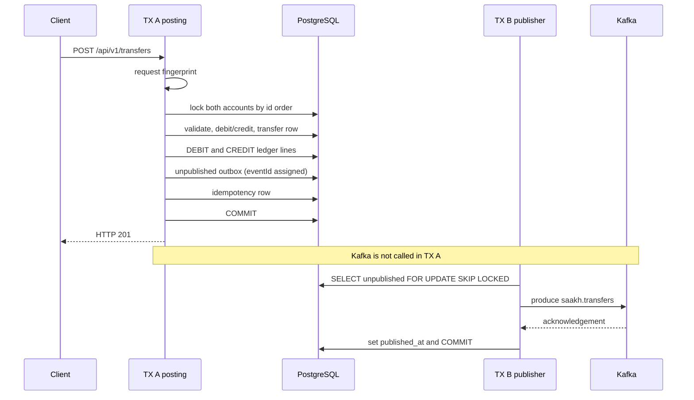
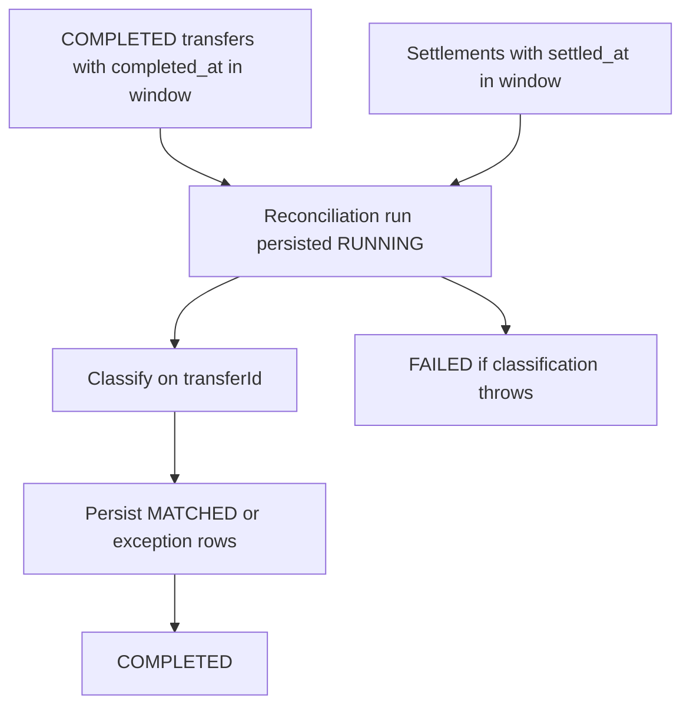

# SAAKH

**Trust Through Every Transaction.**

[](https://github.com/Manjeet2684/SAAKH/actions/workflows/ci.yml)

## Overview

SAAKH is a correctness-focused financial transaction and reconciliation backend. It is a Spring Boot monolith: PostgreSQL is the financial source of truth, and Kafka is used only for transactional-outbox publishing after a transfer commits.

It is not a microservices system, not a distributed platform, and not a bank, UPI, or authentication product.

## Why SAAKH?

Financial posting APIs fail in the real world through retries, duplicate clients, concurrent debits, and a second write to a message broker. SAAKH is built so those cases stay visible and testable.

| Problem | Mechanism in this repo |
|---|---|
| Client retries | Durable `Idempotency-Key` in PostgreSQL |
| Duplicate vs conflicting reuse | Request fingerprint; same body replays, different body returns `409` |
| Concurrent transfers | `SELECT FOR UPDATE` on both accounts, locked in id order |
| Transaction boundaries | One posting transaction for money, ledger, unpublished outbox, and idempotency |
| Database / event dual-write | Outbox row committed with the transfer; Kafka is not called there |
| Financial consistency | Double-entry ledger plus detect-only integrity checks |
| Asynchronous delivery | Scheduled outbox publisher after commit, at-least-once |
| External mismatch | Simulated settlement ingest and detect-only reconciliation |
| Operational visibility | `X-Request-ID`, MDC logs, in-process Micrometer, Actuator health |

## Engineering surface

| Area | SAAKH demonstrates |
|---|---|
| Transactions | Atomic money movement in PostgreSQL |
| Concurrency | Ordered pessimistic account locking |
| Idempotency | Fingerprint-based duplicate protection |
| Ledger | Double-entry debit/credit posting |
| Events | Transactional outbox → Kafka topic `saakh.transfers` |
| Event delivery | Explicit at-least-once semantics |
| Reconciliation | Detect-only financial reconciliation |
| Security | Two API-key audiences; SHA-256 + `MessageDigest.isEqual` |
| Observability | Request IDs, MDC, in-process metrics, health (details hidden) |
| Testing | 47 automated tests + Testcontainers |
| CI / packaging | GitHub Actions tests and local image build; Compose local stack |

## Guarantees

These are current semantics, not future targets.

| Behavior | Result |
|---|---|
| Transfer create | HTTP **201**, body `status=COMPLETED` |
| Transfer exact replay (same key + same body) | HTTP **201**, same `transferId`, money does not move twice |
| Same key + different body | HTTP **409** `IDEMPOTENCY_KEY_REUSED` |
| Missing `Idempotency-Key` | HTTP **400** `MISSING_IDEMPOTENCY_KEY` |
| Insufficient funds / closed / non-customer account | HTTP **422** |
| Settlement create | HTTP **201** |
| Settlement replay (same fingerprint) | HTTP **200** |
| Settlement conflict | HTTP **409** `SETTLEMENT_CONFLICT` |
| Settlement status other than `SETTLED` | HTTP **422** `UNSUPPORTED_SETTLEMENT_STATUS` |
| Reconciliation run | POST HTTP **201**; GET HTTP **200** |
| Invalid recon window (`from` not before `to`) | HTTP **400** `INVALID_WINDOW` |
| Recon time window | Half-open **`[from, to)`** on `completed_at` / `settled_at` |
| Auth failure | HTTP **401** `UNAUTHORIZED`; `X-Request-ID` is still returned |
| Invalid / oversized `X-Request-ID` | Replaced with a generated UUID; the request is **not** rejected |
| Integrity | GET HTTP **200**; overall may be `PASS` while `checks.systemBalance` is `INCONCLUSIVE` |
| Kafka in posting (TX A) | **Not called.** Unpublished outbox row is persisted with the money transaction |
| `published_at` | Set only after Kafka acknowledgement (TX B) |
| Crash after Kafka ack, before `published_at` commit | Same `eventId` may be published again (**at-least-once**, not exactly-once) |

Non-guarantees: no consumer-side deduplication, no XA, no automatic ledger repair, no `GET /transfers/{id}`.

## Technology stack

| Piece | In this repository |
|---|---|
| Language | Java 21 |
| Application | Spring Boot 3.5.16 |
| Persistence | PostgreSQL 16, Flyway V1–V4, Hibernate `ddl-auto=validate` |
| Messaging | Apache Kafka 3.8.1, producer only, topic `saakh.transfers`, `acks=all` |
| Build | Maven Wrapper |
| Containers | Docker, Docker Compose (`saakh-postgres`, `saakh-kafka`, `saakh-app`) |
| Tests | JUnit 5, MockMvc, Testcontainers |
| CI | GitHub Actions (`checkout@v7`, `setup-java@v6`) |

Maven `artifactId` and the Compose database name remain `apexledger` (internal identifier). The product name is SAAKH.

## Architecture

PostgreSQL is the source of truth. Kafka is an after-commit outbox sink, not a second ledger.



Inside the process: HTTP API, TX A posting, TX B outbox publisher, detect-only integrity, detect-only reconciliation. There is no Kafka consumer and no notification writer.

## Transfer flow

**TX A** (PostgreSQL only) posts the transfer. **TX B** copies unpublished outbox rows to Kafka after that commit.



If Kafka acks and the process crashes before `published_at` commits, TX B may publish the same `eventId` again. That is at-least-once delivery. The publisher transaction stays open during Kafka I/O on purpose (no lease columns). `scheduledPoll()` calls `publishBatch()` on the Spring bean so `@Transactional` actually commits.

## Reconciliation flow

Detect-only. These APIs never move money, never write ledger/transfer/outbox rows, and never publish Kafka.



Window is **`[from, to)`**. Match key is `transferId`. Statuses: `MATCHED`, `MISSING_EXTERNAL`, `MISSING_INTERNAL`, `AMOUNT_MISMATCH`, `CURRENCY_MISMATCH`, `DUPLICATE_EXTERNAL`. Settlement `transferId` may be null or unknown (no FK). Only `SETTLED` ingest is accepted. This is not a PSP integration and not automatic repair.

Integrity (`GET /internal/v1/integrity`) is also detect-only and is not persisted. Seed `SYSTEM_FLOAT` has no opening CREDIT, so `checks.systemBalance` is `INCONCLUSIVE` even when overall `status` is `PASS`.

## 5-minute demo

Default path is the full Compose stack (Mode 2). Host-JVM Mode 1 is in [Local setup](#local-setup). Demo accounts are in the [appendix](#appendix).

Do not mix host and container addresses. There is no `GET /transfers/{id}`; use the POST body.

```bash
docker compose up --build
```

Wait until `saakh-app` is listening on port 8080.

```bash
curl -s http://localhost:8080/actuator/health/readiness
```

Expect `{"status":"UP"}`. Health details are not shown. Kafka does not determine readiness.

```bash
curl -s -H "X-API-Key: local-dev-key" \
  http://localhost:8080/v1/accounts/aaaaaaaa-aaaa-aaaa-aaaa-aaaaaaaaaaaa
```

Transfer Alice → Bob, 1000 paise:

```bash
curl -i -X POST http://localhost:8080/api/v1/transfers \
  -H "X-API-Key: local-dev-key" \
  -H "Idempotency-Key: demo-alice-bob-1" \
  -H "Content-Type: application/json" \
  -d "{\"sourceAccountId\":\"aaaaaaaa-aaaa-aaaa-aaaa-aaaaaaaaaaaa\",\"destinationAccountId\":\"bbbbbbbb-bbbb-bbbb-bbbb-bbbbbbbbbbbb\",\"amountMinor\":1000,\"currency\":\"INR\"}"
```

Expect **201**. Note `transferId`. Repeat the exact request: still **201**, same `transferId`. Change `amountMinor` with the same key: **409**.

Windows PowerShell 5.1 strips quotes from inline JSON passed to `curl.exe`. Write the body to a file without a UTF-8 BOM and send it with `--data-binary`:

```powershell
$json = '{"sourceAccountId":"aaaaaaaa-aaaa-aaaa-aaaa-aaaaaaaaaaaa","destinationAccountId":"bbbbbbbb-bbbb-bbbb-bbbb-bbbbbbbbbbbb","amountMinor":1000,"currency":"INR"}'
[System.IO.File]::WriteAllText("$env:TEMP\saakh-transfer.json", $json)
curl.exe -i -X POST "http://localhost:8080/api/v1/transfers" -H "Content-Type: application/json" -H "X-API-Key: local-dev-key" -H "Idempotency-Key: demo-alice-bob-1" --data-binary "@$env:TEMP\saakh-transfer.json"
```

Settlement (replace `TRANSFER_ID`; `local-internal-key`):

```bash
curl -i -X POST http://localhost:8080/internal/v1/settlements \
  -H "X-API-Key: local-internal-key" \
  -H "Content-Type: application/json" \
  -d "{\"externalReference\":\"demo-settle-1\",\"transferId\":\"TRANSFER_ID\",\"amountMinor\":1000,\"currency\":\"INR\",\"settlementStatus\":\"SETTLED\",\"settledAt\":\"2026-09-14T16:00:00Z\"}"
```

Expect **201**. Exact replay **200**. Same `externalReference` with a different amount **409**.

Reconciliation over a window that contains those timestamps:

```bash
curl -i -X POST http://localhost:8080/internal/v1/reconciliation/runs \
  -H "X-API-Key: local-internal-key" \
  -H "Content-Type: application/json" \
  -d "{\"from\":\"2026-01-01T00:00:00Z\",\"to\":\"2027-01-01T00:00:00Z\"}"
```

Expect **201**. `GET /internal/v1/reconciliation/runs/{runId}` returns **200**.

```bash
curl -s -H "X-API-Key: local-internal-key" http://localhost:8080/internal/v1/integrity
```

Expect **200**, overall `PASS`, `checks.systemBalance` = `INCONCLUSIVE`.

```bash
curl -i http://localhost:8080/v1/accounts/aaaaaaaa-aaaa-aaaa-aaaa-aaaaaaaaaaaa
```

Expect **401**.

PowerShell settlement/recon bodies: same BOM-free file + `--data-binary` pattern as the transfer.

## What happens if…?

| If | Then | Proven by |
|---|---|---|
| Client retries the same transfer | One movement; HTTP **201** replay | `TransferApiTest.duplicateIdempotencyKeyDoesNotTransferTwice` |
| Concurrent duplicate posts | Unique constraint loser replays; one transfer | `concurrentDuplicateIdempotencyKeyPostsOnlyOnce` |
| Same key, different payload | HTTP **409**; books unchanged | `sameIdempotencyKeyWithDifferentRequestIsRejected` |
| Kafka publish throws | `published_at` stays null; money already committed; later batch can retry | `OutboxPublisherFailureTest` (**mock**, not a live broker-down E2E) |
| Crash after Kafka ack, before `published_at` | Same `eventId` may be published again | `crashAfterKafkaAckCanRepublishSameEventId` |
| Kafka is not healthy | Readiness still depends on process + PostgreSQL only | `management.health.kafka.enabled=false` |
| Settlement fingerprint conflicts | HTTP **409**; original row kept | `SettlementApiTest` |
| Transfer and settlement disagree | Persisted exception status; no repair | `ReconciliationApiTest` |
| Missing or wrong API key | HTTP **401**; request id still returned | `ApiKeyFilter` / Phase 5 tests |
| Invalid `X-Request-ID` | Server generates a UUID and continues | `RequestIdFilterTest` |

## API reference

Headers: client routes (`/v1/**`, `/api/**`) use `X-API-Key: local-dev-key`. Internal routes use `local-internal-key`. Transfers also require `Idempotency-Key`. Optional `X-Request-ID` (`[A-Za-z0-9._-]`, max 128).

| Method | Path | Purpose | Success | Notable errors |
|---|---|---|---|---|
| GET | `/v1/accounts/{accountId}` | Read a wallet | 200 | 401, 404 |
| POST | `/api/v1/transfers` | Post a customer transfer | **201** create and replay | 400, 401, 409, 422 |
| GET | `/internal/v1/integrity` | Detect-only books check | 200 | 401 |
| POST | `/internal/v1/settlements` | Simulated settlement | **201** create, **200** replay | 400, 401, 409, 422 |
| POST | `/internal/v1/reconciliation/runs` | Run detect-only recon | 201 | 400, 401 |
| GET | `/internal/v1/reconciliation/runs/{runId}` | Fetch run audit | 200 | 401, 404 |
| GET | `/actuator/health` | Health, no details | 200 | — |
| GET | `/actuator/health/liveness` | Process | 200 | — |
| GET | `/actuator/health/readiness` | Process + PostgreSQL | 200 / 503 | Kafka is not in this group |

`/actuator/metrics` is not exposed. Actuator exposure is `health` only.

## Testing

**47** `@Test` methods. No coverage percentage is published.

| Class | Tests | What it exercises |
|---|---|---|
| `TransferApiTest` | 8 | Posting, ledger, outbox persist, idempotency, concurrency, validation, auth |
| `SettlementApiTest` | 5 | Create / replay / conflict, concurrency, auth |
| `FinancialIntegrityApiTest` | 5 | Seed I5, detect-only failures, auth |
| `ApiKeyEqualsTest` | 5 | SHA-256 + constant-time compare, fail-closed blank key |
| `Phase5ObservabilityApiTest` | 4 | Request id, audiences, meters, safe 500 |
| `ReconciliationApiTest` | 3 | Six statuses, window, auth |
| `OutboxPublisherTest` | 3 | Kafka publish, no duplicate outbox on HTTP replay, SKIP LOCKED |
| `OutboxPublisherFailureTest` | 3 | Publish failure, retry, crash-after-ack same `eventId` |
| `RequestIdFilterTest` | 3 | Preserve / replace / MDC clear |
| `MoneyTest` | 2 | Non-negative paise |
| `RequestFingerprintTest` | 2 | Canonical transfer hash |
| `SettlementFingerprintTest` | 2 | Canonical settlement hash |
| `FoundationSchemaTest` | 1 | Flyway demo accounts |
| `ReconciliationFailureTest` | 1 | Durable `FAILED` run |

Examples worth reading first: concurrent idempotency, `crashAfterKafkaAckCanRepublishSameEventId`, six recon statuses, `ApiKeyEqualsTest`.

Docker is required for the Testcontainers-backed suite (`disabledWithoutDocker = true`). Unit tests (`MoneyTest`, fingerprint tests, `ApiKeyEqualsTest`) always run. Most API tests use Testcontainers PostgreSQL and disable the outbox poller. `OutboxPublisherTest` uses Testcontainers PostgreSQL and Kafka.

```bash
./mvnw test
```

On Windows: `.\mvnw.cmd test`.

## CI / Docker

`.github/workflows/ci.yml` on Ubuntu: checkout, Temurin 21, `./mvnw -B test`, then `docker build -t saakh:ci .`. It does not push an image and does not deploy.

The image is multi-stage: `./mvnw -B -DskipTests package`, Eclipse Temurin 21 JRE, non-root user `saakh`. Compose `docker compose up --build` starts PostgreSQL, Kafka, and the app. The app waits for Postgres to be healthy. Kafka is started but is not a required healthy dependency and does not control application readiness. Container addresses are Compose environment variables; host-JVM defaults in `application.yml` stay valid.

## Engineering decisions

1. **One PostgreSQL transaction** for debit/credit, transfer, ledger, unpublished outbox, and idempotency so a crash cannot post half a transfer.
2. **Pessimistic locks** so cached balances cannot be lost under concurrency.
3. **Lock by account id order** so A→B and B→A cannot deadlock.
4. **Idempotency key + fingerprint** so a retry is safe and a reused key with a new body is a conflict.
5. **Double-entry ledger** so every COMPLETED transfer has DEBIT and CREDIT lines integrity can check.
6. **Transactional outbox** so a committed transfer cannot silently omit the event.
7. **Kafka only after commit** so the broker is not a participant in the money transaction.
8. **Stable `eventId`** assigned at insert; the publisher never mints a new id.
9. **`published_at` after ack** so a failed produce is not marked published.
10. **At-least-once** rather than XA or a false exactly-once claim.
11. **Publisher TX open during Kafka I/O** is an intentional scale tradeoff; `self.getObject().publishBatch()` so the transaction commits.
12. **Reconciliation detects**; it does not rewrite the books.
13. **Settlement is simulated HTTP ingest** so mismatches are demonstrable without a PSP.
14. **Two API-key audiences** (client vs internal); compare SHA-256 digests with `MessageDigest.isEqual`; blank configured keys fail closed.
15. **Request ids** live in the header and MDC only, not in financial rows.
16. **Readiness is process + PostgreSQL.** Kafka health is disabled so a broker blip does not mark the app unready to take transfers.

## Limitations / scope

- Spring Boot monolith, not microservices
- Kafka producer only; no consumer
- V1 `notifications.event_id UNIQUE` exists and is unused
- Settlement source is simulated; not a PSP
- Reconciliation and integrity are detect-only
- INR paise only
- Delivery to Kafka is at-least-once
- Local single-node Kafka topology
- Demo keys `local-dev-key` / `local-internal-key` and DB password `apexledger` are in the repo on purpose; not a secret-management platform. Override with `SAAKH_SECURITY_API_KEY` and `SAAKH_SECURITY_INTERNAL_API_KEY`
- CI tests and builds; it does not deploy
- No cloud, Kubernetes, or image registry push
- No `GET /transfers/{id}`
- Seed SYSTEM integrity I5 is `INCONCLUSIVE` by design
- Health `show-details: never`; metrics are in-process, not an HTTP metrics API
- Not a banking system, UPI implementation, or PCI/RBI product

## Local setup

Two supported modes. Both use the same Compose Postgres and Kafka. Do not mix host and container addresses.

| | Host JVM | Application container |
|---|---|---|
| PostgreSQL | `localhost:5433` | `postgres:5432` |
| Kafka | `localhost:9092` | `kafka:19092` |
| Application | `localhost:8080` | `localhost:8080` |

Postgres is published on **host port 5433** (container 5432) so it does not collide with a local Windows PostgreSQL on 5432. Compose database name and user remain `apexledger`. Containers: `saakh-postgres`, `saakh-kafka` (host **9092**), `saakh-app` (host **8080**).

### Mode 1 — Host JVM

Needs Java 21, Docker, and the Maven wrapper. Compose starts only Postgres and Kafka. `application.yml` already points at the host addresses above.

```bash
docker compose up -d postgres kafka
./mvnw spring-boot:run
```

Windows PowerShell:

```powershell
docker compose up -d postgres kafka
.\mvnw.cmd spring-boot:run
```

### Mode 2 — Full containerized stack

Needs Docker only. Compose builds the application image and starts Postgres, Kafka, and the app. The app container overrides datasource and Kafka bootstrap to the **container** addresses. Do not use `localhost:5433` or `localhost:9092` from inside the app container.

```bash
docker compose up --build
```

Verify seed data:

```bash
curl -H "X-API-Key: local-dev-key" http://localhost:8080/v1/accounts/aaaaaaaa-aaaa-aaaa-aaaa-aaaaaaaaaaaa
```

Local/demo keys (not a secret-management platform): `local-dev-key` for `/v1/**` and `/api/**`, `local-internal-key` for `/internal/**`.

## Appendix

### Demo accounts

Flyway V2 seed/demo state only. These balances are the values immediately after seed. Later transfers change them.

`SYSTEM_FLOAT` is **not** a real money-issuance system. It exists so demo customer wallets have balanced double-entry history.

| Name | ID | Kind | Seed balance |
|---|---|---|---|
| SYSTEM_FLOAT | `00000000-0000-0000-0000-000000000001` | SYSTEM | 999,700,000 paise |
| Alice Wallet | `aaaaaaaa-aaaa-aaaa-aaaa-aaaaaaaaaaaa` | CUSTOMER | 100,000 paise (₹1,000.00) |
| Bob Wallet | `bbbbbbbb-bbbb-bbbb-bbbb-bbbbbbbbbbbb` | CUSTOMER | 100,000 paise (₹1,000.00) |
| Charlie Wallet | `cccccccc-cccc-cccc-cccc-cccccccccccc` | CUSTOMER | 100,000 paise (₹1,000.00) |

`SUM(available_balance_minor)` after seed = `1,000,000,000` paise.

V2 also inserts already-published seed outbox rows with event type `TransferPosted`. Live `POST /api/v1/transfers` inserts `TRANSFER_COMPLETED`. The publisher does not emit the seed rows because they already have `published_at`.

### Development phases

Implementation history, not the reading order: (1) foundation and Flyway, (2) atomic transfer engine, (3) outbox publisher, (4) integrity / settlement / reconciliation, (5) request ids, metrics, health, API-key hardening, (6) GitHub Actions and containerized local run.
